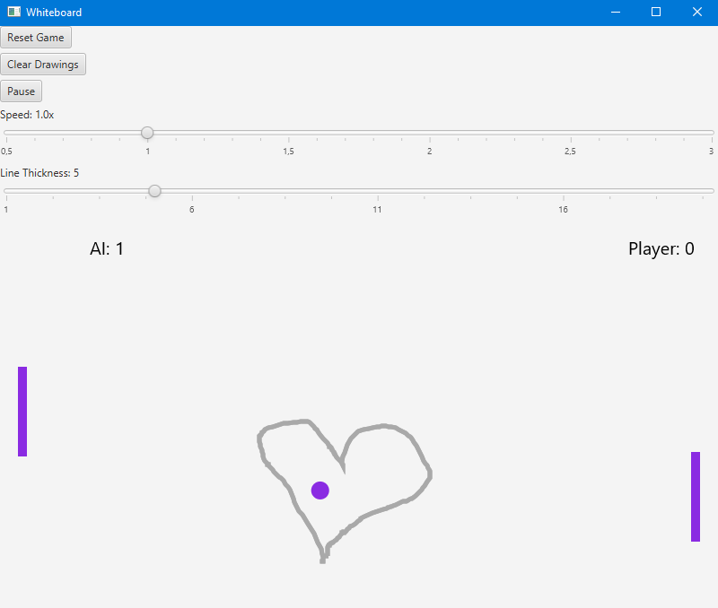

# remimho

## Whiteboard Pong Game

A unique twist on classic ping-pong with drawing capabilities

### Features

- Classic Pong gameplay with AI opponent
- Interactive whiteboard to draw obstacles
- Adjustable game speed and line thickness
- Score tracking for both players
- Pause/resume functionality

### Controls

- **Arrow Up/Down**: Move player paddle
- **Right Mouse Button**: Draw on the canvas
- **Space**: Pause/resume game

### UI Controls

- **Reset Game**: Resets puck and paddle positions
- **Clear Drawings**: Removes all drawn lines
- **Pause/Resume**: Toggles game state
- **Speed Slider**: Adjusts game speed (0.5x-3.0x)
- **Thickness Slider**: Changes drawing line width (1-20px)

### Technical Stack

- **Language**: Kotlin 2.2.20
- **JVM**: Java 23
- **UI Framework**: JavaFX 17.0.8
- **Dependency Injection**: Quarkus 3.28.2
- **Build System**: Gradle (Kotlin DSL)
- **Native compilation**: GluonFX 1.0.27

### Prerequisites

- JDK 17+
- Gradle 8.0+

### How to Run

1. Clone the repository
2. Build with Gradle
3. Run the main class `WhiteboardApplication`
4. ./gradlew build
5. ./gradlew run

### Native Build Configuration
#### 1. Required Software

- **Visual Studio Build Tools 2022** (required for Windows native compilation)
- **GraalVM 25** or later
- **Gradle** (handled by wrapper)
- **JDK 21** or later

#### 2. Visual Studio Setup

1. Install **Visual Studio Community 2022** or **Build Tools for Visual Studio 2022**
2. Select components:
    - **MSVC v143 - VS 2022 C++ x64/x86 build tools (latest)**
    - **Windows 11 SDK (10.0.22621.0)** or later
    - **CMake tools for Visual Studio**

####  3: Set Up Build the Native Application Environment

**CRITICAL:** You must use the x64 Native Tools Command Prompt for Visual Studio:

1. Open **x64 Native Tools Command Prompt for VS 2022**
    - Press `Win + R` → Search for "x64 Native Tools Command Prompt"
    - Or navigate via Start Menu → Visual Studio 2022 → x64 Native Tools Command Prompt

2. Alternatively, set up environment manually:
```cmd
call "C:\Program Files\Microsoft Visual Studio\2022\Community\VC\Auxiliary\Build\vcvars64.bat"
```

####  4: Navigate to Project Directory

```cmd
cd D:\path\to\your\project\remimho
```

####  5: Clean and Build

```cmd

gradle clean

gradle nativeBuild
```

####  Output Files

- `build/gluonfx/x86_64-windows/`
- Look for `ru.rkhamatyarov.main.exe` (Windows executable)
- Or `ru.rkhamatyarov.main.dll` (shared library)


### Screenshot



